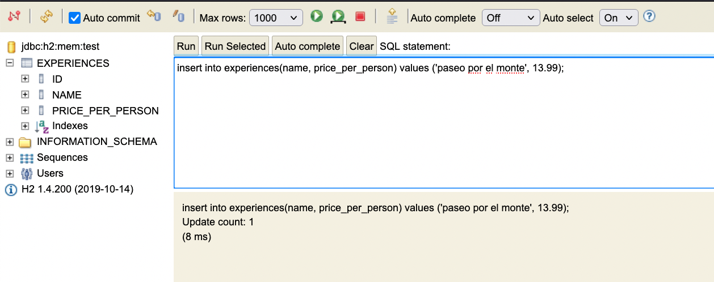

# FullStack Template (SpringBoot + React)


Esta plantilla incluye parte del Backend para desarrollar este proyecto y las herramientas para compilar el frontend tal y como se ha explicado en clase.

### Estructura

- La carpeta `src` contiene el backend (Java, Spring Boot)
- La carpeta `web-client` contiene el frontend, que se compila usando `npm` y `webpack`

## Desarrollo

### Compilación y puesta en marcha

Para compilar todo el código (frontend y backend), podemos usar las tareas `buildFrontend`, `build` y `bootRun` de Gradle.

- Desde línea de comandos: 

```bash
# Usamos "gradlew.bat" en lugar de ./gradlew en Windows
./gradlew buildFrontend build bootRun
```

- Desde IntelliJ usando el menú de Gradle


### Trabajando con el frontend

Podemos usar comandos `npm` para trabajar con el frontend desde la carpeta web-client (`cd web-client`).

Si no queremos tener que lanzar el servidor cada vez que queremos visualizar un cambio en 
el frontend, es posible usar **webpack dev server**.

Desde la carpeta `web-client`, hacemos:

```
npm run develop
```

y de este modo podremos hacer pruebas en `localhost:3000` (el puerto puede configurarse en el archivo `webpack.config.js`).

## Base de datos

Este proyecto incluye una base de datos en memoria H2. Puede modificarse la configuración para sustituir esta base de datos
por una base de datos diferente.

- Panel de H2: Una vez arrancada la aplicación (`bootRun`), puede accederse al panel de configuración
de H2 disponible en `/h2-ui`. Para hacer login deberemos usar la misma configuración de `application.properties`.




## Deploy a Heroku con Postgres

Se incluye un archivo de configuración para un profile de configuración `heroku`. Para activarlo una vez que 
la aplicación en Heroku ha sido creada, es necesario añadir la siguiente variable de configuración: 

```bash
heroku config:set SPRING_PROFILES_ACTIVE=heroku
```